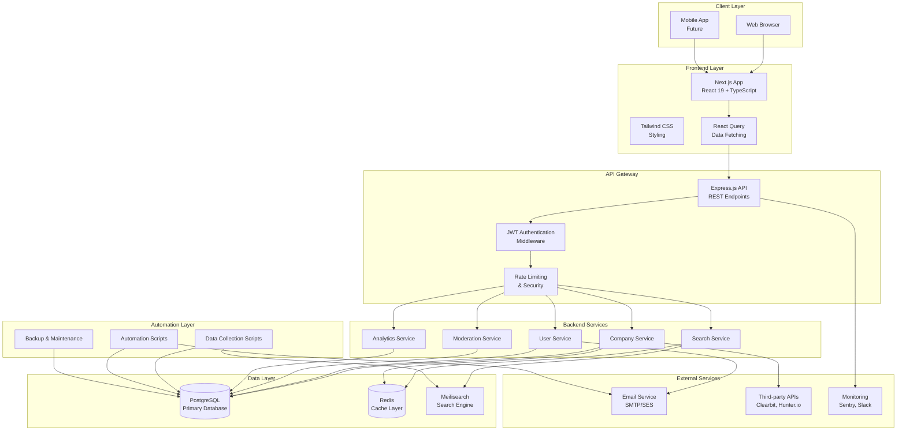
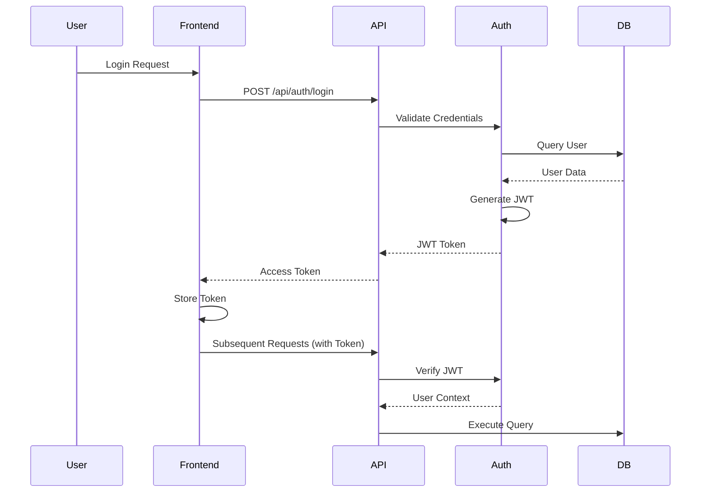
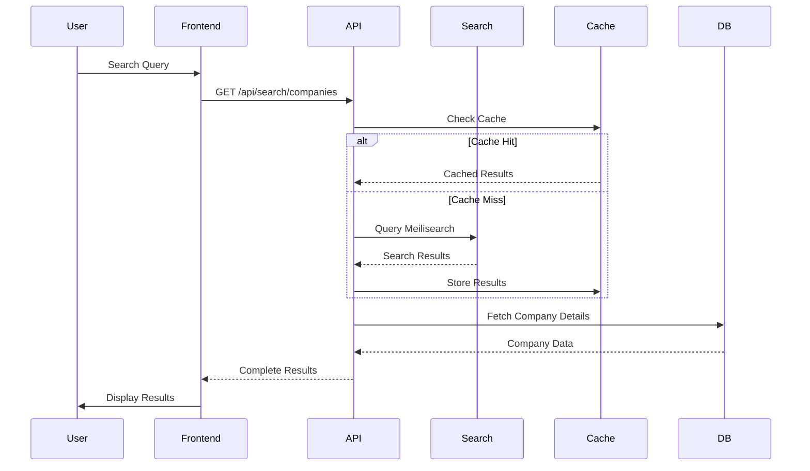
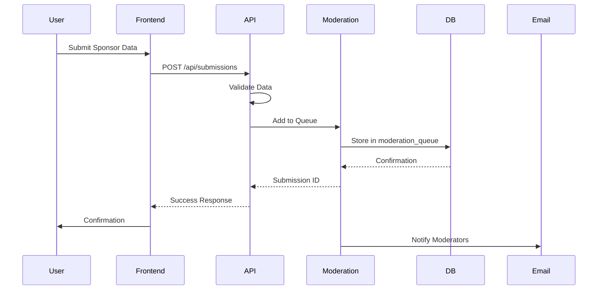
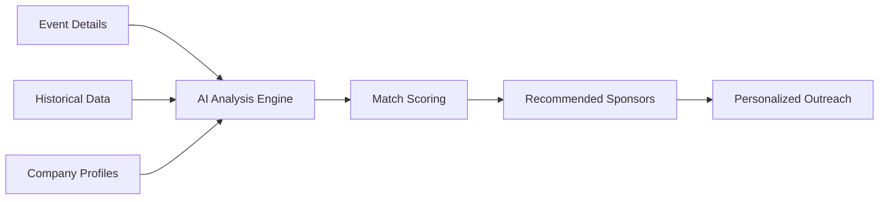
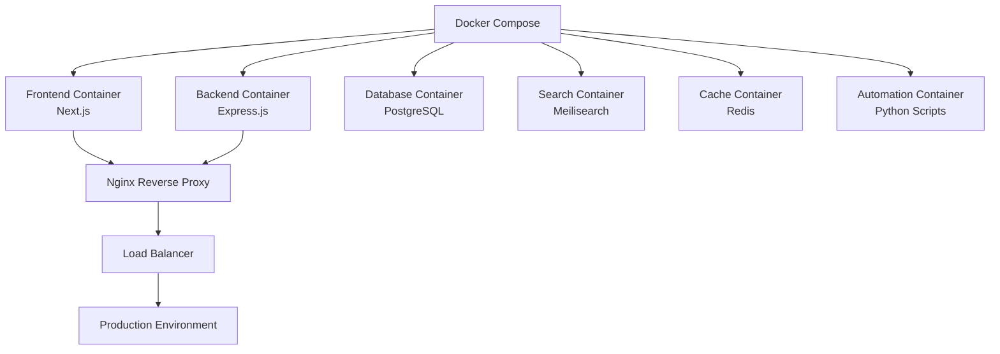
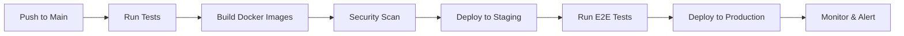
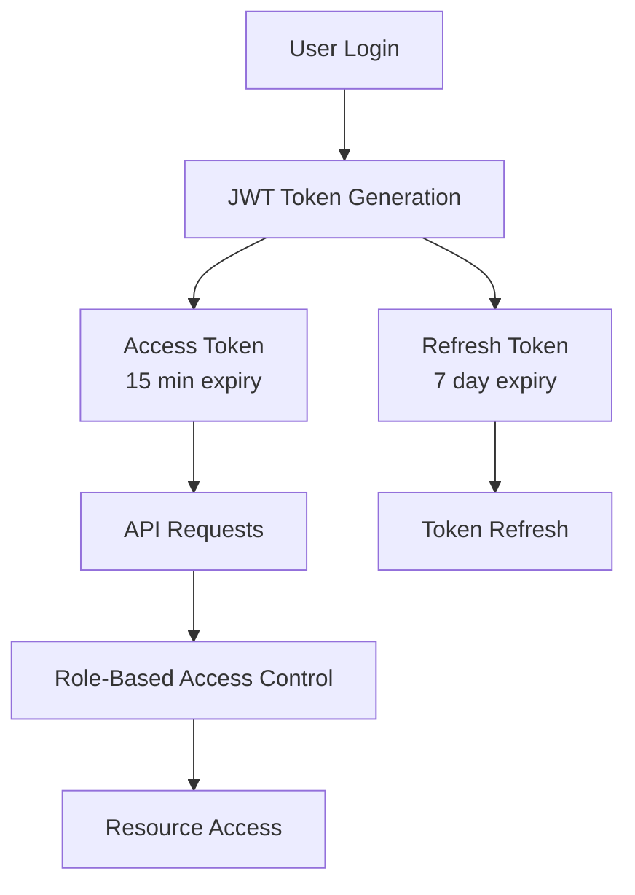

# SponsorBase: Comprehensive Project Analysis & Future Vision

---

## 1. Project Overview & Current State

### Executive Summary

**SponsorBase** is a transformative platform designed to solve a critical pain point in the event organization ecosystem: the lack of a centralized, searchable database of sponsor-friendly companies. Currently in early development stage, SponsorBase aims to democratize access to sponsorship opportunities by creating the world's largest open directory of companies that actively sponsor events.

#### The Problem

Event organizers—hackathon coordinators, college club leaders, tech community managers, and conference planners—face significant challenges when seeking sponsorship partners:

- **No central database of sponsors**: Organizers must scour Google, LinkedIn, and individual company websites to find potential sponsors
- **Difficulty finding correct sponsorship contacts**: Contact information is often buried or outdated
- **Unclear sponsorship information**: Companies' sponsorship preferences, historical patterns, and typical contribution amounts are opaque
- **Time wasted on research**: Hours spent on manual research could be better spent on event planning and execution

This fragmentation leads to missed opportunities, inefficient outreach, and ultimately, fewer successful sponsorships.

#### The Solution

SponsorBase provides a comprehensive, searchable sponsor directory with:

- **Curated company database**: Companies known to sponsor events with verified information
- **Sponsorship categories**: Industry-specific categorization for targeted outreach
- **Public contact emails**: Verified partnership and community contact information
- **Past sponsorship history**: Historical data showing companies' sponsorship patterns and preferences
- **Outreach templates**: Pre-written, customizable email templates for efficient communication
- **Community-driven submissions**: Crowdsourced data from real organizer experiences

#### Current Capabilities

As of the current development stage (Early Development - Q1 2026), SponsorBase has:

- **Professional project structure**: Well-organized directory layout with separate frontend, backend, database, and documentation modules
- **Comprehensive database schema**: Fully designed PostgreSQL schema with 10+ tables covering companies, contacts, sponsorships, users, moderation, and analytics
- **Frontend foundation**: Next.js 16.1.6 with React 19.2.3, TypeScript, and Tailwind CSS 4 setup
- **Documentation ecosystem**: Detailed architecture docs, product vision, roadmap, and contribution guidelines
- **Automation framework**: Planned scripts for data collection, validation, and system maintenance
- **Seed data strategy**: Initial data structure with sample companies, contacts, events, and outreach templates

### Core Tech Stack

#### Frontend
- **Next.js 16.1.6**: React framework with App Router for server-side rendering and optimal performance
- **React 19.2.3**: Latest React version with enhanced features and performance improvements
- **TypeScript 5**: Type-safe development for robust code quality
- **Tailwind CSS 4**: Utility-first CSS framework for rapid, responsive UI development
- **Geist Fonts**: Modern font family optimized for Vercel's design system

#### Backend (Planned/In Progress)
- **Node.js**: JavaScript runtime for server-side logic
- **Express.js**: Web framework for API endpoint management
- **TypeScript**: Type-safe backend development
- **Prisma**: Database ORM for type-safe database operations
- **JWT**: JSON Web Tokens for secure authentication

#### Database
- **PostgreSQL**: Primary relational database with advanced features including:
  - UUID support for unique identifiers
  - Full-text search capabilities with GIN indexes
  - JSONB for flexible data storage
  - Comprehensive indexing strategy for performance
  - Automated timestamp triggers

#### Search & Caching
- **Meilisearch**: Dedicated full-text search engine (primary option)
- **PostgreSQL Full Text Search**: Alternative search solution with GIN indexes
- **Redis**: Planned for caching and session storage

#### Infrastructure (Planned)
- **Vercel**: Frontend hosting and deployment
- **Railway/Render**: Backend hosting
- **Supabase**: Managed PostgreSQL database hosting
- **Cloudflare**: CDN and security layer

---

## 2. Comprehensive System Architecture

### System Architecture Diagram



### Data Flow & Module Interactions

#### User Authentication Flow


#### Sponsor Search Flow


#### Content Submission Flow


### Core Module Interactions

#### Company Module
- **Purpose**: Manage company profiles, contact information, and sponsorship history
- **Key Operations**: CRUD operations for companies, contact management, sponsorship tracking
- **Dependencies**: Database module, Search module, Moderation module
- **Data Flow**: Receives company data from submissions → Validates → Stores in DB → Indexes in Search Engine

#### Search Module
- **Purpose**: Provide fast, relevant search across companies and sponsorships
- **Key Operations**: Full-text search, faceted filtering, autocomplete, ranking
- **Dependencies**: Meilisearch/PostgreSQL, Cache module
- **Data Flow**: Receives search queries → Queries search engine → Applies filters → Returns ranked results

#### User Module
- **Purpose**: Handle user authentication, authorization, and profile management
- **Key Operations**: Registration, login, profile updates, reputation management
- **Dependencies**: Database module, Email module, Authentication middleware
- **Data Flow**: User credentials → Validation → Token generation → Session management

#### Moderation Module
- **Purpose**: Ensure data quality through community moderation and automated filtering
- **Key Operations**: Content validation, spam detection, duplicate detection, approval workflow
- **Dependencies**: Database module, Email module, Automation scripts
- **Data Flow**: New submissions → Automated validation → Manual review → Approval/rejection

#### Analytics Module
- **Purpose**: Track usage patterns, search trends, and platform health
- **Key Operations**: Search analytics, user engagement tracking, performance monitoring
- **Dependencies**: Database module, Monitoring services
- **Data Flow**: User actions → Event logging → Aggregation → Dashboard visualization

---

## 3. Complete Directory & File Structure

```
sponsorbase/
├── .github/                          # GitHub Actions & CI/CD workflows
│   └── (2 items)
├── .gitignore                        # Git ignore rules
├── CONTRIBUTING.md                  # Contribution guidelines
├── LICENSE                           # MIT License
├── README.md                         # Project overview and documentation
├── dcwa.md                           # (Draft/notes file)
├── efdwe.md                          # (Draft/notes file)
├── ejgdwek.md                        # (Draft/notes file)
├── lwjehwje.md                       # (Draft/notes file)
├── e                                 # (Draft/notes file)
├── e of sponsors                     # (Draft/notes file)
├── earch or PostgreSQL Full Text Search  # (Draft/notes file)
├── or search engine                 # (Draft/notes file)
├── tgreSQL                          # (Draft/notes file)
│
├── backend/                          # Backend application code
│   └── middleware/                   # Express.js middleware
│       ├── edmwql                    # (Middleware file)
│       ├── eqdwekfuhwe.md            # (Documentation)
│       ├── fcwedqwed                 # (Middleware file)
│       └── wwwwqswqs                 # (Configuration file)
│
├── database/                         # Database schema and migrations
│   ├── README.md                     # Database documentation
│   ├── diagram.md                    # Database diagram documentation
│   ├── schema.sql                    # Complete PostgreSQL schema
│   └── seed-data.sql                 # Initial seed data
│
├── docs/                             # Comprehensive documentation
│   ├── architecture.md               # System architecture details
│   ├── product-vision.md             # Product vision and strategy
│   └── roadmap.md                    # Development roadmap and phases
│
├── frontend/                         # Next.js frontend application
│   ├── README.md                     # Frontend-specific documentation
│   ├── package.json                  # Frontend dependencies
│   ├── package-lock.json             # Locked dependency versions
│   ├── tsconfig.json                 # TypeScript configuration
│   ├── next.config.ts                # Next.js configuration
│   ├── eslint.config.mjs             # ESLint configuration
│   ├── postcss.config.mjs            # PostCSS configuration
│   ├── .gitignore                    # Frontend-specific git ignore
│   └── app/                          # Next.js App Router
│       ├── layout.tsx                # Root layout component
│       ├── page.tsx                  # Home page component
│       ├── globals.css               # Global CSS styles
│       └── favicon.ico               # Website favicon
│
└── scripts/                          # Automation and utility scripts
    ├── automation/                   # System automation scripts
    │   └── README.md                 # Automation documentation
    │       # Planned scripts:
    │       # - backup-database.py
    │       # - cleanup-old-data.py
    │       # - update-search-index.py
    │       # - user-onboarding.py
    │       # - auto-moderator.py
    │       # - health-check.py
    │       # - welcome-email.py
    │       # - weekly-digest.py
    │
    └── data-collection/               # Data collection scripts
        └── README.md                 # Data collection documentation
            # Planned scripts:
            # - company-scraper.py
            # - event-scraper.py
            # - contact-finder.py
            # - email-validator.py
            # - company-verifier.py
            # - csv-importer.py
            # - api-importer.py
```

### Directory & File Descriptions

#### Root Configuration Files
- **README.md**: Primary project documentation with overview, tech stack, and getting started instructions
- **CONTRIBUTING.md**: Guidelines for contributors including setup, workflow, and coding standards
- **LICENSE**: MIT License governing open-source usage
- **.gitignore**: Git ignore patterns for Node.js, Next.js, and development files

#### Backend Directory (`backend/`)
- **Purpose**: Server-side API and business logic
- **middleware/**: Express.js middleware for authentication, rate limiting, logging, and error handling
- **Status**: Early development - middleware structure planned but not fully implemented

#### Database Directory (`database/`)
- **schema.sql**: Comprehensive PostgreSQL schema with 10+ tables including companies, contacts, sponsorships, users, moderation queue, and analytics
- **seed-data.sql**: Initial seed data with sample companies, contacts, events, sponsorship history, outreach templates, and users
- **README.md**: Database documentation and setup instructions
- **diagram.md**: Database entity relationship documentation

#### Documentation Directory (`docs/`)
- **architecture.md**: Detailed system architecture including tech stack, API design, security considerations, and deployment strategy
- **product-vision.md**: Product mission, target audience, value proposition, and long-term goals
- **roadmap.md**: 5-phase development roadmap from Q1 2026 through 2027 with detailed milestones and success metrics

#### Frontend Directory (`frontend/`)
- **app/**: Next.js App Router structure with layout.tsx, page.tsx, and global styles
- **package.json**: Frontend dependencies including Next.js 16.1.6, React 19.2.3, Tailwind CSS 4, and TypeScript
- **tsconfig.json**: TypeScript configuration for type checking
- **next.config.ts**: Next.js configuration for build and deployment
- **Status**: Basic Next.js setup with default template - custom SponsorBase UI not yet implemented

#### Scripts Directory (`scripts/`)
- **automation/**: Planned automation scripts for database maintenance, user management, content moderation, monitoring, and email automation
- **data-collection/**: Planned scripts for web scraping, data validation, and bulk data import from various sources
- **Status**: Documentation complete - scripts not yet implemented

---

## 4. The Future Vision: Taking the Project Forward

### Phase 2 & 3 Features: Logical Next Steps

#### Phase 2: MVP Development (Q2 2026)

**Core Features**
- **Advanced Search Interface**: Implement faceted search with filters for industry, sponsorship level, geographic location, and event type
- **Company Profile Pages**: Detailed company pages showing sponsorship history, contact information, and partnership preferences
- **User Authentication System**: Complete JWT-based authentication with registration, login, password recovery, and email verification
- **Contact Management**: Verified contact database with department-specific emails (partnerships, community, marketing)
- **Sponsorship History Tracking**: Comprehensive timeline of companies' past sponsorships with amounts, levels, and event details
- **Outreach Template System**: Template library with customizable variables for hackathons, conferences, and meetups
- **Basic Analytics Dashboard**: User dashboard showing search history, saved companies, and outreach tracking

**Technical Enhancements**
- **Meilisearch Integration**: Implement full-text search with typo tolerance, faceted search, and ranking
- **Responsive UI Components**: Build reusable component library with shadcn/ui or similar
- **API Rate Limiting**: Implement rate limiting to prevent abuse and ensure fair usage
- **Email Service Integration**: Set up transactional email for notifications and outreach
- **CI/CD Pipeline**: GitHub Actions workflow for automated testing and deployment

#### Phase 3: Community Features (Q3 2026)

**Community-Driven Features**
- **User-Generated Content**: Allow authenticated users to submit new companies, contacts, and sponsorship information
- **Reputation System**: Gamified reputation scoring based on contribution quality and verification
- **Moderation Queue**: Community moderation workflow with voting, flagging, and admin approval
- **Voting Mechanism**: Community voting on data accuracy and relevance
- **Outreach Tracking**: Track email opens, responses, and successful sponsorships
- **Advanced Filters**: Search by sponsorship frequency, average amount, responsiveness, and industry focus

**Enhanced Capabilities**
- **Email Integration**: Direct email sending from platform with tracking and templates
- **Bulk Outreach**: Send personalized outreach emails to multiple sponsors
- **CRM Features**: Track conversations, follow-ups, and sponsorship negotiations
- **Analytics Dashboard**: Detailed analytics on search trends, popular sponsors, and success rates
- **API for Integrations**: REST API for third-party event management platforms

### AI & Automation Opportunities

#### Generative AI Integration

**AI-Powered Sponsorship Recommendations**


**Implementation Strategy**
- **Machine Learning Model**: Train on historical sponsorship data to predict sponsorship likelihood
- **Natural Language Processing**: Analyze event descriptions and company profiles for semantic matching
- **Recommendation Engine**: Score companies based on industry alignment, past behavior, and event fit
- **Automated Outreach**: Generate personalized outreach emails using LLMs (GPT-4, Claude)
- **Response Prediction**: Predict likelihood of positive response based on historical patterns

**Smart Automation Features**
- **Automated Data Enrichment**: Use Clearbit API to automatically enrich company profiles with industry, size, and funding information
- **Email Validation**: Integrate Hunter.io or NeverBounce for real-time email verification
- **Duplicate Detection**: ML-powered duplicate detection to maintain data quality
- **Spam Filtering**: Automated spam detection using NLP and pattern recognition
- **Trend Analysis**: Identify emerging sponsorship trends and recommend proactive outreach

**Autonomous Data Collection**
- **Web Scraping Automation**: Automated scraping of event sponsor pages, press releases, and company announcements
- **Social Media Monitoring**: Monitor Twitter, LinkedIn, and company blogs for sponsorship announcements
- **Event Calendar Integration**: Automatically discover upcoming events and their sponsors
- **Contact Discovery**: AI-powered contact discovery using publicly available information
- **Data Verification**: Automated cross-referencing across multiple sources for accuracy

### Infrastructure & Deployment

#### Containerization Strategy

**Docker Implementation**


**Dockerfile Structure**
- **Multi-stage builds**: Optimize image sizes for production
- **Health checks**: Implement container health monitoring
- **Secrets management**: Use Docker secrets for sensitive data
- **Volume mounts**: Persistent storage for database and logs

#### CI/CD Pipeline

**GitHub Actions Workflow**


**Pipeline Stages**
1. **Lint & Test**: Run ESLint, TypeScript checks, and unit tests
2. **Build**: Build Docker images for all services
3. **Security Scan**: Run vulnerability scans (Snyk, Trivy)
4. **Staging Deployment**: Deploy to staging environment
5. **E2E Testing**: Run Playwright end-to-end tests
6. **Production Deployment**: Blue-green deployment to production
7. **Monitoring**: Deploy monitoring dashboards and alerting

#### Cloud-Native Deployment

**Infrastructure Options**
- **Vercel**: Frontend hosting with automatic SSL, CDN, and edge deployment
- **Railway/Render**: Backend hosting with managed PostgreSQL and Redis
- **AWS/GCP**: Alternative for full control with ECS, EKS, or Cloud Run
- **Kubernetes**: For enterprise-scale deployment with auto-scaling

**Deployment Architecture**
- **Multi-region deployment**: Deploy to multiple regions for low latency
- **Auto-scaling**: Horizontal scaling based on traffic patterns
- **Database replication**: Read replicas for improved performance
- **CDN integration**: Cloudflare or AWS CloudFront for static assets
- **Load balancing**: Application load balancer for high availability

#### Monitoring & Observability

**Monitoring Stack**
- **Application Monitoring**: Sentry for error tracking and performance monitoring
- **Infrastructure Monitoring**: Datadog or New Relic for system metrics
- **Log Aggregation**: ELK Stack or CloudWatch Logs for centralized logging
- **Uptime Monitoring**: UptimeRobot or Pingdom for availability tracking
- **Custom Dashboards**: Grafana dashboards for business metrics

**Key Metrics to Track**
- **Performance**: API response time, page load time, search latency
- **Reliability**: Uptime, error rates, database connection pool health
- **Business**: User growth, search volume, successful sponsorships, conversion rates
- **Community**: Contribution rates, data accuracy, moderation queue size

### Security & Performance

#### Security Enhancements

**Authentication & Authorization**


**Security Measures**
- **JWT with Refresh Tokens**: Secure authentication with token rotation
- **Rate Limiting**: Prevent abuse with per-IP and per-user limits
- **Input Validation**: Comprehensive validation and sanitization of all inputs
- **SQL Injection Prevention**: Parameterized queries and ORM usage
- **XSS Protection**: Content Security Policy and input sanitization
- **CSRF Protection**: Token-based CSRF protection for state-changing operations
- **HTTPS Everywhere**: Enforce SSL/TLS for all connections
- **Secrets Management**: Environment variables and secrets manager
- **Regular Security Audits**: Automated security scanning and penetration testing
- **Data Encryption**: Encrypt sensitive data at rest and in transit

#### Performance Optimization

**Database Optimization**
- **Query Optimization**: Analyze slow queries and add appropriate indexes
- **Connection Pooling**: Implement connection pooling for efficient database access
- **Read Replicas**: Offload read queries to replicas for improved performance
- **Caching Strategy**: Multi-layer caching with Redis for frequently accessed data
- **Database Sharding**: Horizontal partitioning for large-scale data

**Frontend Optimization**
- **Code Splitting**: Lazy load routes and components for faster initial load
- **Image Optimization**: Next.js Image component for automatic optimization
- **Static Generation**: Pre-render static pages where possible
- **Client-Side Caching**: Implement aggressive caching strategies
- **Bundle Size Optimization**: Tree shaking and code elimination

**Search Performance**
- **Search Index Optimization**: Optimize Meilisearch indexes for relevance
- **Query Caching**: Cache common search queries
- **Autocomplete**: Implement autocomplete for faster search experience
- **Pagination**: Efficient pagination for large result sets
- **Faceted Search**: Pre-compute facets for fast filtering

#### Scalability Considerations

**Anticipated Bottlenecks**
1. **Database Growth**: As the sponsor database grows to 10,000+ companies, query performance may degrade
   - **Solution**: Implement read replicas, query optimization, and consider sharding

2. **Search Latency**: Full-text search across large datasets may become slow
   - **Solution**: Dedicated search engine (Meilisearch), query caching, and index optimization

3. **Email Delivery**: High-volume email sending may hit rate limits
   - **Solution**: Email queue with rate limiting, multiple SMTP providers, and delivery monitoring

4. **Concurrent Users**: High traffic during event planning seasons may overwhelm servers
   - **Solution**: Auto-scaling infrastructure, load balancing, and CDN integration

5. **Data Quality**: Community submissions may introduce low-quality data
   - **Solution**: Automated validation, reputation systems, and robust moderation

**Scaling Strategy**
- **Horizontal Scaling**: Add more instances as traffic increases
- **Vertical Scaling**: Upgrade instance sizes for compute-intensive operations
- **Database Scaling**: Implement read replicas and eventual sharding
- **Cache Scaling**: Distributed Redis cluster for cache scalability
- **CDN Scaling**: Global CDN for static asset delivery

### Advanced Future Features (Phase 4-5)

#### Phase 4: Advanced Features (Q4 2026)

**Enterprise Capabilities**
- **CRM Integration**: Two-way sync with Salesforce, HubSpot, and Pipedrive
- **Advanced Analytics**: Predictive analytics for sponsorship success rates
- **Team Collaboration**: Multi-user accounts with role-based permissions
- **Custom Workflows**: Configurable outreach and approval workflows
- **API Webhooks**: Real-time notifications for external integrations
- **White-label Solutions**: Custom branding for enterprise customers

**Mobile Applications**
- **iOS App**: Native iOS app for on-the-go sponsor research
- **Android App**: Native Android app with full feature parity
- **Push Notifications**: Real-time alerts for new sponsorship opportunities
- **Offline Mode**: Cached data for offline access

**Premium Features**
- **Tiered Subscription**: Free tier with basic features, premium tier with advanced capabilities
- **Priority Support**: Dedicated support for enterprise customers
- **Custom Reports**: Custom analytics and reporting
- **API Access**: Higher rate limits and advanced API features

#### Phase 5: Platform Expansion (2027)

**AI-Powered Intelligence**
- **Predictive Sponsorship Modeling**: ML models to predict sponsorship likelihood
- **Natural Language Queries**: Chat interface for natural sponsor discovery
- **Automated Negotiation**: AI-assisted negotiation and follow-up
- **Market Intelligence**: Industry trends and sponsorship market analysis

**Ecosystem Integration**
- **Event Platform Integration**: Native integrations with Eventbrite, Meetup, and Hopin
- **Virtual Event Sponsorships**: Support for virtual and hybrid event sponsorships
- **Sponsor Marketplace**: Two-sided marketplace connecting organizers and sponsors
- **Payment Processing**: Handle sponsorship payments and contracts

**Global Expansion**
- **Multi-language Support**: Localization for major languages
- **Regional Sponsor Databases**: Country-specific sponsor information
- **Currency Support**: Multi-currency sponsorship amounts
- **Local Compliance**: GDPR, CCPA, and regional data protection compliance

### Success Metrics & KPIs

#### Technical Metrics
- **API Response Time**: < 200ms for 95th percentile
- **Search Latency**: < 100ms for typical queries
- **Uptime**: 99.9% availability (8.76 hours downtime/year)
- **Database Query Performance**: < 50ms for 95th percentile
- **Page Load Time**: < 2 seconds for initial page load

#### Business Metrics
- **Monthly Active Users**: Target 10,000+ by end of 2026
- **Sponsor Database Size**: Target 5,000+ verified companies by end of 2026
- **Successful Sponsorships**: Track and optimize for successful connections
- **User Retention**: 40%+ month-over-month retention
- **Conversion Rate**: 5%+ conversion from search to outreach

#### Community Metrics
- **Contribution Rate**: 20%+ of users contribute data
- **Data Accuracy Score**: 95%+ accuracy through verification
- **Moderation Queue Time**: < 48 hours average review time
- **Reputation Distribution**: Healthy distribution of user reputation scores

### Competitive Advantages

1. **Open Database Model**: Unlike closed databases, SponsorBase is community-driven and openly accessible
2. **Event-Specific Focus**: Tailored specifically for event sponsorships, not general business directories
3. **Historical Tracking**: Unique data on past sponsorship behavior and patterns
4. **Free Core Access**: Essential features remain free for organizers, democratizing access
5. **Community Verification**: Crowdsourced verification ensures data accuracy and relevance
6. **AI-Powered Insights**: Advanced AI features for intelligent sponsor matching and outreach

### Conclusion

SponsorBase is positioned to become the definitive platform for event sponsorships, transforming how organizers discover and connect with sponsor-friendly companies. With a solid technical foundation, clear product vision, and ambitious roadmap, the project has the potential to scale from a working prototype into an industry-grade powerhouse.

The combination of modern tech stack, comprehensive database design, community-driven approach, and AI-powered features creates a unique value proposition in the market. By following the phased development roadmap and implementing the recommended infrastructure and security measures, SponsorBase can achieve sustainable growth and become the standard platform for event sponsorships worldwide.

The future is bright for SponsorBase - with the right execution, strategic partnerships, and continuous innovation, it can democratize access to sponsorship opportunities and empower event organizers globally to create amazing experiences.
